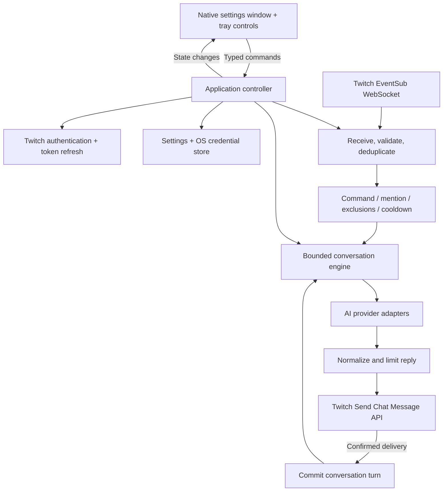

# MPD Bot — proposed architecture

Status: **design for review; implementation is paused**. The source currently in this workspace is an exploratory, unverified prototype. It predates the native-window decision and is not the approved architecture.

## 1. Confirmed product requirements

- Project name: **MPD Bot**; package/executable identifier: `mpd-bot`.
- Rust application for Windows, macOS, and Linux.
- Very low resource use on a streaming PC, especially while the settings window is closed.
- Direct Twitch integration using EventSub and the Twitch API.
- Native desktop configuration window and tray icon.
- OpenAI Responses API, Anthropic Messages, OpenRouter, and explicitly configured OpenAI-compatible endpoints.
- Configure personality, system prompt, model, and credentials.
- First release delivers the core chat bot. Streamer.bot and legacy extras are later work.

### Accepted POC visual direction

The user accepted the existing POC UI as a starting point. Preserve its dark palette, mint accents, sidebar navigation, grouped settings, private reply preview, and connection/status summary when implementing the native window. Layout and styling can be refined later. This accepts the visual direction, not the browser-based implementation or a final native toolkit choice. The configurable bot persona/account name is separate from the product name.

Proposed v1 boundaries: one running instance, one bot identity, one Twitch channel, one active AI provider, text-only replies, and bounded per-viewer memory. These are scope recommendations, not restrictions inherent in the eventual engine.

## 2. Architecture in one view

One application process. UI and network work communicate using bounded, typed Rust channels. The native UI calls the application controller directly: **no local HTTP server or browser frontend is needed for v1**.

## 3. Desktop UI and process lifecycle

### Recommended candidate: Slint, with egui/eframe as the alternative

Slint provides a native desktop UI with Rust application logic and a small declarative UI description. Its built-in `SystemTrayIcon` is a useful fit for this application and can keep the event loop alive while the settings window is hidden. It does not embed a browser. Its UI is toolkit-rendered; a native desktop window does not imply every control is an operating-system widget. Validate appearance, keyboard navigation, and accessibility.

The runtime review recommends testing Slint first because forms and tray support are central to this app. Its licensing/distribution terms must fit the intended project license; do not silently choose a license for the user. If those terms or measured performance are unsuitable, test egui/eframe with a separate tray adapter. No framework dependency is being added during this planning stage.

Before committing, build a small **UI feasibility experiment**, not the full bot. Verify close-to-tray, reopening, pause, quit, accessibility, and resource use on all three operating systems. Choose renderer and feature flags from measurements. Framework selection remains provisional until this passes.

| Option | Fit | Tradeoff |
| --- | --- | --- |
| Slint + built-in tray | Preferred experiment: forms-oriented UI and first-party tray lifecycle | Adds a UI DSL; confirm licensing/distribution fit and Linux tray behavior |
| egui/eframe + tray adapter | Alternative: UI written directly in Rust | More hand-built form behavior; renderer, accessibility, and tray/event-loop integration need testing |
| Tauri | Alternative if web-based UI development and packaged desktop integration are preferred | Uses an OS webview plus frontend code; measure the complete process tree, not just the Rust host |
| Local browser page | Previously prototyped | Superseded by the user's native-window requirement |

The main OS thread owns the window and tray event loop. A background thread runs a current-thread Tokio runtime for async network tasks. Blocking keychain/file operations run outside UI and network polling. Neither event loop waits synchronously for the other. UI commands use a small bounded channel; core status is coalesced into a latest snapshot and wakes the UI only when needed.

UI updates should be event-driven. A hidden window must not repaint continuously or poll status on a timer. Tray/menu events wake the UI loop. On Linux, prefer a supported StatusNotifier backend where suitable, and explicitly test the intended desktop environments. A missing system tray must leave a usable window and Quit control; hiding the only means of reopening the app is unacceptable.

Tray menu:

- Open settings
- Connection status
- Pause / Resume bot
- Quit

Closing the window hides it when tray access works. **Pause** prevents new requests and suppresses unsent replies; it does not lose configured credentials. **Quit** cancels outstanding work, shuts down connections, and exits. No auto-start or auto-update in v1.

Use an explicit OS instance lock. A second launch should activate the existing window, or show a clear already-running message if activation is unavailable; it must not start a second bot connection. Avoid keeping the prototype's HTTP listener solely as an instance-lock substitute.

## 4. Internal responsibilities

Start with one Cargo package and clear modules. Split into crates only when reuse or independent releases justify it.

| Module | Owns | Must not own |
| --- | --- | --- |
| `domain` | Typed messages, identifiers, configuration, errors, delivery outcomes | UI widgets or HTTP clients |
| `application` | Lifecycle, settings revisions, cancellation, command admission | Provider-specific JSON |
| `ui` / `tray` | Forms, validation feedback, status, user actions | Long-running network operations |
| `twitch::auth` | OAuth session, validation, refresh, identity/scopes | AI personality |
| `twitch::events` | EventSub session, subscriptions, reconnects, deduplication | Unbounded chat history |
| `twitch::send` | Helix delivery and rejection results | AI request retries |
| `engine` | Reply policy, context selection, bounded memory, prepared turns | Twitch WebSocket details |
| `providers` | Requests, response parsing, provider capabilities and errors | Persistent credentials |
| `storage` | Versioned settings, migrations, atomic writes, credential references | Chat transcript persistence by default |
| `diagnostics` | Bounded counters and redacted errors | Raw tokens or full chat logs by default |

A future Streamer.bot adapter produces the same domain input and reports a delivery result. It does not require provider or memory logic to be duplicated. Do not implement that adapter or expose a remote-control API in v1.

## 5. Twitch authentication

Recommended: **public-client OAuth device authorization**, using a registered Twitch application Client ID. The Client ID is public; a distributed desktop binary must not embed a client secret.

Normal setup:

1. User clicks **Connect Twitch**.
2. App displays the device code and opens Twitch's authorization page in the user's browser.
3. User authorizes the intended bot account.
4. App completes the token exchange and validates account identity and scopes.
5. User selects/enters the channel; app resolves its ID and connects EventSub.

Required user-token scopes: `user:read:chat` and `user:write:chat`. Do not request moderation, management, or app-token bot scopes unless a later feature requires them.

Authentication is a separate state machine: disconnected → awaiting authorization → authorized → refreshing → reauthorization required. Honor Twitch's polling interval and authorization expiry; allow cancellation. Validate at startup and at Twitch's required periodic interval. Serialize refresh attempts, retain rotated refresh tokens, and prevent a stale refresh from overwriting a newer account connection.

Store the access/refresh credential bundle in OS credential storage. If the store is unavailable, offer an explicitly labeled session-only connection. Never silently save tokens as plaintext. After unrecoverable refresh failure, stop outbound chat and show **Reconnect Twitch**.

The auth manager is the sole token owner. Store the rotating token pair together, namespace by application Client ID, and validate against that expected Client ID. Helix callers obtain the current token rather than keeping stale copies across refreshes. A disconnect action best-effort revokes access and removes local credentials; pausing is a separate operation.

**Release prerequisite:** register/choose the Twitch public OAuth application. Recommended distribution uses the maintainer's public Client ID so end users do not each need to create an app. A configurable development Client ID is useful for local development. Registration and ownership need to be settled before OAuth implementation/live testing.

## 6. Twitch transport and reliability

- Receive `channel.chat.message` over one EventSub WebSocket.
- Subscribe after the welcome session ID arrives, within Twitch's allowed window.
- Service keepalive/Ping frames independently of slow AI or credential work.
- Send replies through Helix `POST /helix/chat/messages` using the authorized bot's identity and the matching Client ID.
- Treat HTTP success and `is_sent: true` as distinct checks. An HTTP 200 with a drop reason is not delivered chat.
- On a normal disconnect: reconnect with capped exponential backoff plus jitter, then recreate subscriptions.
- On Twitch's directed reconnect: keep consuming the old socket until the replacement receives its welcome; subscriptions transfer and must not be recreated.
- On revocation/auth failure: distinguish authorization revoked, user removed, and unsupported subscription version; route to reauthorization, configuration recovery, or an update as appropriate.
- Deduplicate EventSub `metadata.message_id` with both an age limit and a capacity limit. Keep chat `event.message_id` separately for reply threading. Keep the cache across short reconnects. Document that bounded caching is not a promise of exactly-once delivery forever.
- Surface subscription conflicts such as HTTP 409; do not delete another session's subscription automatically.
- Do not blindly retry chat sends with an unknown outcome: that risks duplicate messages.
- Ignore messages from the bot itself, excluded users, and relayed Shared Chat sources outside the configured channel.

Shared Chat needs explicit setup documentation: replies sent with user access tokens can be shared across the active Shared Chat session. The `for_source_only` option is not available with user access tokens.

Retry policy is operation-specific: a proven authentication rejection may refresh once and retry once; a timed-out send may already have reached chat and is not retried automatically. Apply rate-limit backoff without accumulating stale replies. Preserve sanitized Twitch drop reasons for diagnostics.

## 7. Message processing and memory

Proposed trigger policy: `!ai <message>` or a message beginning with `@bot_login`. Ordinary chat does not invoke an AI provider. Empty triggers do not produce invented requests.

Flow:

1. Validate event identity and channel, deduplicate, and apply exclusions.
2. Match a command/mention and enforce input size/cooldown.
3. Admit at most one live AI request. Skip excess work rather than accumulating a delayed backlog.
4. Snapshot configuration and conversation context for this request.
5. Call the selected provider with a deadline and cancellation support.
6. Normalize text and enforce the full outgoing message limit.
7. Check that the bot is still active and the request belongs to the current channel/configuration generation.
8. Send through the transport and classify the result.
9. Commit the completed conversation turn after confirmed delivery.

Distinguish **generated**, **sent**, **rejected**, **unknown delivery**, and **cancelled**. Do not tell the model a viewer saw a reply that was never delivered. A private test request has its own temporary context and never enters live chat memory.

Memory keys use platform, channel ID, and stable user ID, not display names. Default proposal: 64 conversations × 6 complete turns, evicted by least recent use. Enforce both a turn limit and an overall byte budget. A setting change cannot allow older oversized history to bypass current limits. Session memory is cleared on exit; transcript storage and global cross-viewer context are deferred.

## 8. AI providers

Use a shared HTTP client and narrow adapters around the official REST formats. Avoid shipping several heavyweight SDKs. Keep requests/responses and provider errors typed at the application boundary.

For this fixed provider set, prefer a closed provider enum dispatching to small adapters over a dynamic plugin system. Shared transport code owns TLS, bounded response reads, deadlines, authentication injection, and error mapping. The engine does not match on raw provider JSON.

| Provider | API format |
| --- | --- |
| OpenAI | Responses API, system instructions + input, `store: false` |
| Anthropic | Messages API, separate system prompt and message list |
| OpenRouter | OpenAI-compatible chat completions |
| Custom compatible service | Explicit full endpoint + supported wire format |

Model IDs are editable strings; never silently rewrite an unfamiliar model. Provider profiles remember their own model and credential reference. Switching providers must not accidentally send a previous provider's key to a new endpoint.

Support text-only generation in v1. Extract visible output, not reasoning/tool blocks. Some models require a larger output budget for reasoning; do not force temperature or other optional parameters on every model. Report missing text, refusals, invalid models, authentication failures, rate limits, and timeouts clearly.

No automatic cross-provider failover, tool execution, or silent billable retry in v1. Compatible endpoints use HTTPS, with an explicit loopback HTTP allowance for local services. Redirect behavior must not leak credentials to a different destination.

## 9. Configuration and credentials

- Versioned settings file in the OS user configuration directory; atomic replacement and migration support.
- UI validates before applying changes and shows unsaved state.
- Model/provider settings separate from secrets.
- Windows Credential Manager, macOS Keychain, and Linux Secret Service for persistent secrets.
- Provider keys are write-only after entry; show configured/missing status and replacement/removal controls.
- Twitch access and rotated refresh tokens are persisted consistently.
- Redacted, bounded diagnostics. Logs must not contain authorization headers, complete URLs with secrets, or provider response bodies by default.
- Explain to users that selected messages/context go to their chosen AI provider. Memory safety does not make untrusted chat instructions trustworthy.

## 10. Performance acceptance proposal

These are **initial targets to validate**, not measurements or guarantees. The first experiment decides whether they are realistic on the agreed reference machines.

| Scenario | Proposed target/check |
| --- | --- |
| Connected, window hidden, idle | Under 50 MiB process resident memory where platform accounting permits; investigate platform baseline differences |
| Hidden, steady idle CPU | Under 0.1% of one logical CPU averaged over 10 minutes; no continuous UI repaint |
| Settings window open | Target under 100 MiB process resident memory; record GPU memory separately |
| Cold startup to usable settings | Target under 2 seconds, excluding network login |
| Long stream / synthetic chat flood | Memory reaches a bounded plateau; no delayed reply backlog; UI/tray and EventSub keepalives remain responsive |
| Release package | Report actual compressed size and installed size; minimize dependencies before setting a hard byte budget |

Record OS, hardware, renderer, release build, CPU normalization, private/resident memory, and GPU allocation. Run idle, active chat, an AI request, network failure, and a long-stream soak separately. Provider inference latency is not local runtime performance.

## 11. Deliberately deferred

Voice/transcription, global transcript context, shoutouts/auto-shoutouts, random replies, game events, multiple channels, other chat platforms, Streamer.bot integration, local inference, streaming token display, plugins, auto-updates, and launch-at-login.

## 12. Sources

- [Twitch guidance: EventSub and API calls for new chatbots](https://dev.twitch.tv/docs/chat/irc)
- [EventSub WebSocket lifecycle](https://dev.twitch.tv/docs/eventsub/handling-websocket-events/)
- [Chat subscription authorization](https://dev.twitch.tv/docs/eventsub/eventsub-subscription-types/#channelchatmessage)
- [Send Chat Message authorization and delivery result](https://dev.twitch.tv/docs/api/reference/#send-chat-message)
- [Public-client device OAuth](https://dev.twitch.tv/docs/authentication/getting-tokens-oauth/#device-code-grant-flow)
- [Token validation](https://dev.twitch.tv/docs/authentication/validate-tokens/)
- [egui/eframe](https://docs.rs/eframe/latest/eframe/)
- [Slint Rust event loop](https://docs.slint.dev/latest/docs/rust/slint/)
- [Slint built-in tray](https://docs.slint.dev/latest/docs/slint/reference/window/systemtrayicon/)
- [Slint licensing terms to review before selection](https://slint.dev/terms-and-conditions)
- [Tray event-loop and platform requirements](https://docs.rs/tray-icon/latest/tray_icon/)
- [OpenAI Responses](https://developers.openai.com/api/reference/cli/resources/responses/methods/create)
- [Anthropic Messages](https://platform.claude.com/docs/en/api/messages/create)
- [OpenRouter API](https://openrouter.ai/docs/quickstart)
