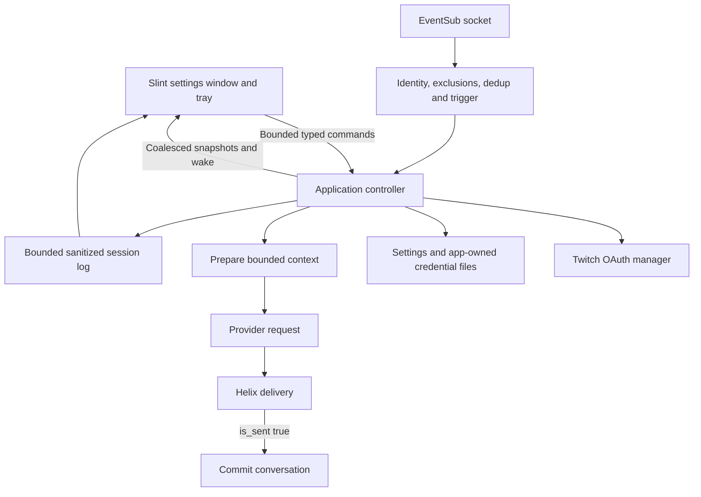

# MPD Bot — implemented desktop architecture

Status: **desktop milestone implemented; acceptance has remaining items**. Updated 2026-09-15. This document describes the current source. Earlier review reports remain historical design inputs. See [VALIDATION.md](VALIDATION.md) for tested behavior and [PLAN.md](PLAN.md) for remaining work.

## 1. Product boundary

MPD Bot is a Rust desktop Twitch chatbot with configurable personality, prompt, model and credentials. It receives chat directly through EventSub and sends through Helix. OpenAI Responses, Anthropic Messages, OpenRouter and explicit compatible endpoints are supported.

The milestone targets Windows desktop/tray behavior while keeping macOS/Linux code paths. One bot identity, one channel, one active provider and text replies are in scope. The native UI preserves the MPD cyan/slate branding and displays **A twitch bot with real personality** and **Control Room**.

## 2. Runtime and module boundaries

| Source | Responsibility |
| --- | --- |
| `src/main.rs` | Startup, per-user instance lock, settings loading, curated crash/startup reporting, UI/runtime shutdown |
| `src/application.rs` | Typed commands/snapshots, lifecycle, readiness, revisions, admission, cancellation and feature integration |
| `src/ui.rs` | Native callbacks, view conversion, draft preservation, tray lifecycle, log presentation and native dialogs |
| `ui/desktop.slint` | Settings, OAuth, preview, Logs, About and tray presentation |
| `desktop-view/` | Local crate compiling generated Slint view code |
| `src/config.rs` | Versioned settings, validation and atomic writes |
| `src/secrets.rs` | Provider credential files and startup environment overrides; `load(directory)`, persistence and removal |
| `src/credential_files.rs` | Bounded credential-file reads, atomic replacement and platform file-access restrictions |
| `src/twitch/auth.rs` | Public device OAuth, validation, serialized rotation and account lifecycle |
| `src/twitch/auth_store.rs` | Versioned OAuth credential bundle persisted as one app-owned JSON file; storage trait retained for future backends |
| `src/twitch/mod.rs` | EventSub sessions, deduplication, trigger admission and Helix delivery |
| `src/engine.rs` | Prepared turns, bounded per-viewer memory and output cleanup |
| `src/provider.rs` | HTTP wire formats, bounded response parsing and typed provider errors |
| `src/diagnostics.rs` | Approved event/field types, bounded ring and sanitized export |

The OS main thread owns Slint/Winit windows and tray events. A separate thread runs a current-thread Tokio runtime. Blocking file operations and permission helpers use workers. The native UI calls the controller through a bounded channel, not an HTTP configuration API. There is no browser bearer-token session or local configuration listener.

The command channel holds at most 32 commands; application jobs have bounded admission. Latest desktop state is shared in a snapshot, and event-loop wakes are coalesced. UI refreshes are event-driven. Log snapshots are bounded copies published at application event boundaries; the log text is rebuilt when relevant visible state changes. This is not an incremental log-stream implementation.

## 3. Desktop choice and lifecycle

The selected toolkit is **Slint 1.17.1**, with the Winit backend and **software renderer**. It renders a native application window without a webview. The generated view lives in a small local crate; business logic remains in ordinary Rust modules. About includes Slint attribution. This toolkit decision does not choose MPD Bot's own repository license.

Windows Minimize and Close hide to the tray. Open restores the same window and retained drafts. Tray Pause/Resume changes runtime admission; Quit goes through the application exit flow. The UI has a visible fallback when tray setup fails. Browser-form password-manager detection is removed by the native settings controls. Saving keys always targets the app-owned files; the UI has no storage checkbox or OS credential-vault integration.

An exclusive OS file lock in the default user configuration directory prevents multiple real instances even when `--data-dir` differs. A second launch explains how to reopen the tray window; automatic activation of another process is not implemented. Demo mode uses its own isolated settings and no saved credentials/Twitch tasks.

Shutdown invalidates active work, cancels authorization, stops transport/jobs and lets OAuth credential workers finish within the controlled shutdown path. A fixed, sanitized crash marker is separate from normal session logs. It does not persist panic payloads.

## 4. Application correctness boundaries

The controller admits one AI operation at a time, holding the permit through live delivery. Context is prepared under a short engine lock; provider/network calls execute outside it. Excess requests are skipped, not delayed in a backlog. Private preview has isolated context and cannot commit live memory.

Configuration/connection revisions identify active work. Applied changes, pause, disconnect and shutdown invalidate older requests. Transport checks revision immediately before each Helix send attempt, including a refresh retry. A send already accepted by Twitch cannot be retracted; cancelling a local future does not prove remote non-delivery.

A generated reply owns its prepared turn and busy permit. Only `is_sent: true` permits the application to commit the turn after a current-revision check. Rejected, cancelled and unknown-delivery operations drop the prepared turn. No memory is committed merely because generation succeeded or HTTP returned 200.

Memory keys use platform, channel ID and stable chatter ID. Login exclusions are applied by the transport before generation. Defaults are 64 conversations × 6 viewer messages and their matching replies (complete exchanges), with a 2 MiB content budget and configured upper bounds. The UI calls these “Remembered messages per viewer”; `memory_turns` stays unchanged in saved settings. Its reactive planning estimate uses min(2 MiB, viewers × messages × (4000 input bytes + 4 × max reply characters)) plus an approximate per-viewer/message collection allowance. Zero messages yields zero estimated chat history. This estimate excludes app/UI, logs and in-flight provider buffers and is not a process RAM guarantee. Least-recently-touched conversations are evicted. Settings changes and exit clear session memory.

## 5. Twitch OAuth

The normal flow is Connect Twitch → browser consent on Twitch → validated account → channel connection. The UI receives a short-lived verification link/code for presentation only. Passwords and client secrets are never collected by MPD Bot.

A maintainer-owned **Public** Twitch application is required. `MPD_BOT_TWITCH_CLIENT_ID` can be supplied at build time or as a runtime development override. The public Client ID is not a secret. The maintainer-supplied Client ID is configured in `.cargo/config.toml`; live OAuth acceptance remains pending.

Required scopes are `user:read:chat` and `user:write:chat`. The manager validates the expected Client ID, identity and scopes before use. The connected account's validated login drives bot mentions; the destination channel is separate.

The access/refresh pair is stored together in `credentials/twitch-{clientid}.json` under the selected configuration directory. This versioned, unencrypted JSON record includes validated identity, scopes and expiry. Refresh attempts are serialized and single-use rotations are persisted promptly. Credential adoption uses generation/authorization guards so late work cannot restore a disconnected or replaced login. File-storage failures remain visible in the connection UI. The OAuth storage trait is retained for a possible future OS-store backend; no such backend is used by this build.

Application maintenance validates hourly even while the bot is paused or the chat connection is disabled. Startup restores and validates saved credentials. A proven Helix 401 permits one refresh and one retry; each operation obtains current credentials and confirms user/client/scopes still match. Terminal authorization failures require reconnect. Temporary network failures remain distinguishable from invalid authorization.

Disconnect clears local authorization, deletes the stored record and attempts revocation. `MPD_BOT_LEGACY_TWITCH=1` is an explicit development fallback for `TWITCH_ACCESS_TOKEN`; it is access-only, requires the saved bot login and has no refresh lifecycle. OAuth takes precedence over this fallback.

## 6. EventSub and delivery

One EventSub WebSocket receives `channel.chat.message`. Subscription creation, hourly legacy validation, generation/send, reconnect handoff and socket reads are separate futures, keeping Ping/keepalive processing responsive during AI requests.

- Subscribe after welcome using its session ID.
- On a directed reconnect, receive on the original socket until the replacement welcome; subscriptions transfer automatically.
- On normal disconnect, reconnect with capped exponential delay and recreate subscriptions. Backoff currently has no jitter.
- Deduplicate EventSub metadata message IDs with a 512-entry, ten-minute cache retained across reconnects. Chat event message IDs remain separate for reply threading.
- Ignore self messages, excluded logins and relayed Shared Chat sources outside the configured channel.
- Sample ordinary chat with a uniform lightweight PRNG draw from 0–99 against `random_reply_percent` (default 10, validated 0–100). Deduplication and transport busy/rate-limit checks happen before selection. Enabled leading commands or bot mentions bypass sampling; generation still enforces pause, admission and cooldown. No extra channel history is stored.
- `command_enabled` defaults false; `respond_to_mentions` defaults true. Existing configs receive these defaults while retaining their command text. Skip disabled direct mentions and `!commands` rather than selecting them randomly. Leading mentions match the bot’s authenticated login.
- Surface subscription conflicts without deleting another session's subscriptions.
- Do not blindly retry a timed-out/ambiguous chat send. On HTTP 429, use a bounded reset/retry delay and suppress new replies without a queue.
- Map known Twitch drop reasons to curated status messages; do not echo arbitrary upstream messages.

Outgoing text is normalized and bounded, including the viewer mention, to Twitch's 500-character limit. Shared Chat delivery follows Twitch's user-token rules; `for_source_only` is unavailable for these tokens.

## 7. Provider transport

A shared Reqwest client uses TLS, disabled redirects, connection/request deadlines and bounded response reads. Small enum-based adapters implement the supported wire formats; multiple provider SDKs or a plugin system are unnecessary for this milestone.

Model IDs remain editable. OpenAI uses Responses with `store: false`; Anthropic uses Messages; OpenRouter and explicit compatible endpoints use chat completions. Compatible endpoints accept HTTPS or loopback HTTP and use a dedicated optional key. Unsupported optional generation parameters are not forced on every model. No automatic billable retry, cross-provider failover, tools or streaming-token UI is included.

`ProviderError` holds classified failure, HTTP status, bounded model/request identifiers and latency. Static summaries distinguish authentication, rate limits, missing model/endpoint, invalid request, service/network failure and invalid/empty responses. Raw provider body strings are never exposed through diagnostics.

### Named API profiles

`src/profiles.rs` owns a versioned bounded store (16 profiles, 64 KiB total) with stable internal IDs, unique display names, provider/model/endpoint fields and independent keys. All profile edits and active-selection changes write one atomic credential file. The controller clones the store, validates and persists it on a blocking worker, then applies it in memory. Failed writes do not replace the applied profile/key pair. A corrupt store is not silently reset. Changing provider or endpoint discards the old key unless a replacement is supplied.

The active profile is resolved for every AI request; profile mutations share the settings mutation gate, invalidate pending generation/delivery, and clear conversation memory. Provider/model/endpoint fields in config.json remain compatibility mirrors; the profile store is authoritative. Global settings writes preserve current profile settings. UI profile drafts are separate from shared bot-setting drafts, and profile controls wait for an explicit success/failure acknowledgement. Select, Save & use, rename, remove key and delete never expose key text in snapshots or logs. The existing provider credential loader remains only for one-time migration and legacy Twitch environment auth.

## 8. Settings, secrets and diagnostics

Unversioned POC settings deserialize as schema version 1; the next save writes the version. The configuration path remains unchanged, and unsupported/invalid settings fail without overwrite. Named API profiles now persist together in `credentials/ai-profiles.json`; OAuth uses `credentials/twitch-{clientid}.json`. Both are versioned, unencrypted JSON separate from settings and diagnostics. `--data-dir` selects a distinct credential directory, while the conservative per-user instance lock remains global.

The shared credential-file helper bounds reads to 64 KiB, rejects links/reparse points at the credential path, restricts access and atomically replaces records. Unix files use mode `0600`, with directory mode `0700`. Windows uses a hidden PowerShell/.NET helper to install a fresh protected access list containing only the current account and SYSTEM, replacing inherited and unrelated explicit entries. The helper receives the path through its child environment; secret values are never command arguments. File operations run outside the UI event loop.

There is no keyring/OS credential-vault backend and no automatic import of existing OS-stored values. Upgraders re-enter API keys and connect Twitch once, after which the app restores its files on restart. Old OS entries remain untouched. When no profile store exists, the current config and legacy provider files are imported once, with environment variables taking precedence for that import. Existing profile stores are authoritative; legacy files remain untouched and provider environment variables no longer override profiles.

The profile module keeps serialized credential records private and intentionally has no Debug implementation for records/stores. UI snapshots carry only profile metadata and a has-key boolean. Legacy and OAuth credential values use a redacted-debug wrapper. OAuth authorization display fields are separate from general logs. API calls necessarily send the selected prompt/context to the configured provider.

Diagnostics accept a fixed event enum and bounded approved fields. The session ring is limited by both 1,000 entries and 2 MiB. Producers use a nonblocking lock attempt and count dropped events. Logs expose timestamp, level, subsystem, summary and safe details, with filtering/search, follow/pause, clear and explicit local export.

There is no automatic session-log or transcript file. Secrets, authorization headers, OAuth codes/links, prompts, reply/chat text and arbitrary upstream Debug/body dumps are excluded. The only automatic crash artifact is the fixed-content marker described above. These controls limit what the application records; they are not a claim about provider retention policies.

## 9. Validation and remaining scope

The automated suite covers mocked OAuth/storage races, redaction, protocol parsing, bounded memory/logs, request errors, controller cancellation and configuration behavior. Windows native release smoke results are recorded separately in [VALIDATION.md](VALIDATION.md).

Still required: live consent/receive/send/restart checks; user password-manager verification; broader accessibility/scaling and suspend/resume checks; macOS/Linux runtime acceptance; connected-bot resource measurements and long-stream/flood soak (the isolated UI idle measurement is recorded in VALIDATION.md).

Initial resource targets remain provisional: hidden idle below 50 MiB resident memory, open window below 100 MiB, hidden CPU below 0.1% of one logical CPU over ten minutes, and usable startup below two seconds excluding login. Record actual platform/hardware/renderer and test conditions; do not substitute a smoke check for those measurements.

Voice, shoutouts, random replies, game events, multiple channels, Streamer.bot, other chat platforms, local inference, plugins, auto-start and auto-update remain deferred.

## References

- [Slint system tray](https://docs.slint.dev/latest/docs/slint/reference/window/systemtrayicon/)
- [Slint desktop licensing and attribution](https://slint.dev/terms-and-conditions)
- [Twitch device OAuth](https://dev.twitch.tv/docs/authentication/getting-tokens-oauth/#device-code-grant-flow)
- [Twitch token validation](https://dev.twitch.tv/docs/authentication/validate-tokens/)
- [EventSub WebSocket lifecycle](https://dev.twitch.tv/docs/eventsub/handling-websocket-events/)
- [Twitch Send Chat Message](https://dev.twitch.tv/docs/api/reference/#send-chat-message)