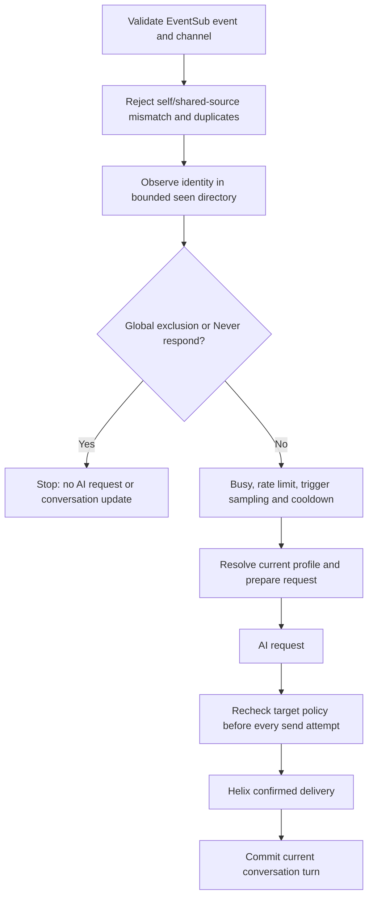

# Chatter profiles: architecture and execution plan

Status: **Implemented locally; automated and Windows native validation completed as recorded in VALIDATION.md.** 2026-09-16.
Baseline: `main` at `c9db4cf` (v0.1.0). The original design and acceptance checklist below are retained; the implementation notes take precedence where details changed.

## 1. Product behavior

A streamer can save a Twitch chatter by typing their username or selecting a previously seen chatter, add a nickname and a short description, choose how the bot should speak to them, and prevent the bot from responding to them.

Decisions for the first implementation:

- New **Chatters** sidebar page; separate from AI provider profiles and transient conversation memory.
- Profiles apply to that Twitch account throughout this local MPD Bot configuration, including if the configured channel changes. Explain this scope in the UI. Channel-scoped profiles were considered; global scope avoids requiring a configured/resolved channel for manual entry and matches the existing app-wide ignore list. No multi-channel configuration is being added.
- Manual username entry works offline. A profile can be saved before the bot has observed the account.
- Nickname and description are optional. No selected styles means use the bot's normal personality.
- Independent checkboxes, as selected by the streamer: **Sarcastic**, **Praise**, **Hero**, **Regular**. Combinations are allowed; they guide wording rather than force every response to contain every style. All are unchecked by default.
- Prompt meanings: **Sarcastic** adds playful sarcasm; **Praise** adds encouragement; **Hero** gives playful admiration and celebratory treatment; **Regular** uses a familiar, welcoming tone for a returning community member. Do not invent personal history or accomplishments. Keep these explanations in prompt behavior; the UI checkbox labels remain the four simple words above.
- These manually selected styles do not change reply probability, bypass limits, grant Twitch roles, or trigger automatic greetings. The four choices replace the proposed VIP treatment option; no VIP decision remains pending.
- **Never respond** wins over every style and all random, mention, and command triggers. It is a local reply rule; it does not ban the chatter or hide their chat.
- Keep the real `@twitch_login` and Twitch reply threading in outgoing messages. The model can use the nickname naturally in the body; a nickname is not a replacement Twitch mention or identity.
- Persist account metadata and manually entered profile details. Do not introduce persistent chat transcripts, automatic personality inference, embeddings, or extra AI calls.

Example: `pixelpilot` / nickname `Pilot` / description `Enjoys retro games and speedrunning; regular on Friday streams` / Sarcastic + Praise. An admitted message gets that profile as context. Setting Never respond prevents an AI request even if they use the configured command or mention the bot.

## 2. Current implementation and integration points

| Current code | Relevant behavior | Planned change |
| --- | --- | --- |
| `src/twitch/mod.rs`, `ChatEvent`, `session`, `eligible`, `trigger`, `helix` | Stable chatter ID and login already arrive through EventSub; busy and exclusion checks currently share one early filter | Separate observation from response selection; consult a typed chatter policy; guard every chat-send attempt |
| `src/application.rs`, `AppCommand`, `AppSnapshot`, `generate`, `GeneratedReply`, `commit` | Bounded commands, applied-state snapshots, serialized mutations, one request at a time | Own chatter state, CRUD/query commands, acknowledgements and policy invalidation |
| `src/engine.rs`, `prepare`, `delivered` | Session-only per-platform/channel/user conversations; only confirmed sends commit | Prepare per-request chatter context; forget a target user's conversations on policy edits |
| `src/provider.rs`, `request`, `complete` | Builds a common system prompt, maps it to each provider | Accept the prepared instruction text with optional chatter context; preserve each provider's existing wire format |
| `src/config.rs`, `Config.excluded_users` | Existing global ignored logins, including default bot accounts | Preserve as an independent, additive exclusion rule |
| `src/ui.rs`, `ui/desktop.slint` | Native drafts, bounded typed commands, explicit save results | Dedicated chatter editor and bounded search results |
| `src/credential_files.rs` | Restricted-access, atomic files with a 64 KiB cap | Extract/reuse protected file primitives with an explicit per-store cap; retain current credential limits |

Important existing boundary: pausing the bot currently disconnects EventSub. This feature preserves that behavior. Previously seen means observed while MPD Bot was connected and active; it is not an online viewer list or historical Twitch lookup.

## 3. Identity and data ownership

Add `src/chatters.rs`, splitting into a small module directory only if implementation size warrants it. Use existing Rust/Serde collections and file utilities; no database or new service is required at these bounds.

### Curated profile

Conceptual fields (Rust names can be finalized in implementation):

- `profile_id`: locally generated stable ID, used for editor selection and acknowledgements.
- `identity`: `PendingLogin { login }` or `TwitchUser { user_id, login }`.
- `nickname`: optional bounded string.
- `description`: bounded string.
- `styles`: fixed enum set (`sarcastic`, `praise`, `hero`, `regular`), not arbitrary executable prompt templates.
- `never_respond`: boolean, default false.
- Metadata needed for persistence/versioning, plus an in-memory policy revision.

Normalize typed usernames: trim, remove one optional leading `@`, lowercase ASCII, then use the existing Twitch login validator. Reject URLs, spaces, and control characters. Show the normalized login before saving. Display names are presentation only and never matching keys; the first version can use the existing login without adding display-name metadata.

Resolution rules:

1. Match observed stable user ID against a bound profile first.
2. Otherwise, match a pending profile's normalized login and bind it to that observed ID.
3. Once bound, never fall back to matching that profile by an old login. A different account using that login must not inherit the profile or its block.
4. Update a bound account's current login from a matching ID; do not change its profile ID or notes.
5. Reject duplicate pending logins and duplicate bound IDs; selecting an existing chatter opens its profile instead of creating another.
6. Do not silently merge competing profiles. Show the conflict and keep any applicable deny rule in effect while resolving it.
7. Editing a bound username cannot reassign its identity. To describe another account, add another profile. Pending names remain editable to correct typos.

Manual entries show **Not seen yet** until an observed identity can be confirmed. This avoids an extra Twitch lookup/scope in the first feature. An unobserved name cannot follow a rename until its identity is known; make that limitation clear without blocking manual entry.

### Previously seen entry

Store only `twitch_user_id`, latest normalized `login`, `last_seen_at` (UTC), and `last_seen_channel_id`. A global bounded directory is sufficient for this single-channel bot; the channel ID records where the latest observation occurred. Do not persist message text, reply text, or per-message events. Repeated messages update an existing record.

### Proposed storage and resource bounds

| Data | Default hard bounds | Retention |
| --- | --- | --- |
| Saved profiles | 500 profiles; 2 MiB serialized file | Until explicitly deleted; never evicted automatically, including deny-only profiles |
| Previously seen | 2,000 accounts; 1 MiB serialized file | Most recently seen; expire after 90 days and evict oldest as needed |
| Nickname | 64 Unicode scalar characters and 256 UTF-8 bytes | Part of saved profile |
| Description | 500 Unicode scalar characters and 2,000 UTF-8 bytes | Part of saved profile |
| UI result page | 50 lightweight rows, plus one selected full profile | Replaced by query/page changes |
| Added prompt context | Maximum 4 KiB after serialization and fixed explanatory text | Current request only |

Enforce count and encoded-byte bounds independently, including JSON escaping. Validate that the assembled per-chatter prompt context fits its 4 KiB cap rather than silently truncating saved details. Trim unnecessary whitespace, reject control characters except permitted description newlines, and validate aggregate serialized size before saving. A full profile store gives a clear error; never evict a saved block to make room.

These are planning defaults, not new user-facing tuning knobs for the first release. Show counts and the seen retention policy. Extend Memory & limits with a separate estimate for the chatter directory/profile data; distinguish it from remembered conversations and total process RAM. Measure steady-state and write-time allocation at the caps; target low single-digit MiB of steady-state overhead and investigate anything above 8 MiB. Do not claim the serialized file limits are exact RAM limits.

## 4. Persistence, startup, and failure behavior

Use two independently versioned files beneath a private `chatters/` subdirectory of the selected data directory:

- `chatter-profiles.json`: curated instructions and reply rules.
- `seen-chatters.json`: recoverable observation metadata.

Keeping them separate prevents frequent seen updates from rewriting descriptions and deny rules. Index by stable ID and by unresolved normalized login so the common message path uses bounded hash lookups. Missing files initialize empty stores; existing `config.json`, API profiles and Twitch credentials retain their formats. Keep the current protected-file semantics (bounded reads, symlink/reparse rejection, private permissions, temp file + sync + atomic replacement). Existing credential callers must retain their 64 KiB cap. Do not put usernames or descriptions in logs or dump whole store values with Debug. The current helper syncs file contents but not the parent directory: do not claim guaranteed rename persistence through sudden power loss. A stronger durability guarantee would require explicit platform validation.

### Saving profiles

- Explicit Save/Delete validates a proposed change, uses a single serialized writer, and acknowledges completion only after a successful durable write.
- Ordinary failed edits preserve the previous applied profile and the editor draft.
- Selecting **Never respond** remains a draft until Save. Once an accepted Save requests a new deny, install an immediate in-memory deny and cancel unsent work for that target before awaiting disk.
- If saving that deny fails, retain the session-only deny and show **Blocked for this session; could not save. Retry to keep this after restart.** Do not show a durable success. Track retry/revert explicitly so a later unrelated save cannot lose the pending deny.
- Clearing a deny or deleting a denied profile must persist successfully before replies become eligible again. Confirm removal of a deny as part of Delete.
- Initial pending-login-to-ID binding is an authoritative identity mutation: queue a prompt durable write and do not treat it as a disposable seen-cache update. While pending, retain a temporary ID-to-pending-profile association and any deny in memory; do not mark the authoritative stored identity bound until the write succeeds. Coalesce binding jobs by profile ID, bounded by the 500-profile cap; a failed binding write must stay visible and must not silently relax policy. Bound-state UI means the binding has been saved. An app crash before that acknowledgement can still leave the earlier pending-login form on disk.
- Login refresh metadata can be coalesced once the stable binding is durable. Do not allow a stale background snapshot to overwrite later profile edits or deletes. Binding and metadata jobs carry the expected profile revision; the writer discards or rebases stale jobs instead of resurrecting a deleted record. Never await binding file I/O inside the EventSub receive branch.

### Saving observations

- Observe in memory with a short bounded lookup/update, never a disk write or permission subprocess per chat message.
- One coalescing writer flushes dirty seen state on a fixed 30-second cadence (not an indefinitely postponed debounce), and on orderly shutdown with a bounded 5-second wait.
- At most one write is in flight per store. Sequence numbers retain dirty state if new observations arrive during a write. Coarsen persisted last-seen timestamps to one-minute precision and skip unchanged snapshots to reduce write volume during a busy stream. No unbounded task or event queue.
- On failure, keep bounded dirty state, report one persistent status, and retry with backoff rather than log every message. A crash can lose observations since the last successful flush; saved profiles and blocks are not on this best-effort schedule.
- Prune expired/oldest observations at load and bounded maintenance points. Clearing seen history is an explicit write; prevent an older in-flight snapshot from restoring cleared data.

### Startup failures and recovery

Load curated policy before enabling reply admission. Unsupported/corrupt curated data remains untouched; suspend live replies and offer a clear recovery notice instead of silently treating every chatter as allowed. A corrupt seen directory can disable that cache with a warning while valid curated profiles continue to work; offer an explicit clear/rebuild action. Do not destroy either file automatically.

Deletion semantics:

- **Delete profile** removes curated details/rules, but the account can remain in Recently seen. If an old global exclusion still applies, deleting/unblocking a profile cannot override it.
- **Forget from seen** removes observation metadata only. Future messages may add it again.
- **Clear seen history** never deletes saved profiles or their deny rules.
- Seen TTL/cap eviction has no effect on curated profiles or blocks.

## 5. Runtime policy and prompts

### Inbound order

This placement discovers chatters even when their message was not selected, the bot was busy, a cooldown was active, or they were ignored. It still excludes the bot's own account, duplicate events, malformed identities and other-channel Shared Chat sources. Discovery does not mean the bot will reply. Avoid per-message UI wakes and disk activity.

### Hard deny and in-flight behavior

Implement reply eligibility in typed Rust code, not as an instruction asking the model to remain silent. Enforce it before provider admission and immediately before every Helix chat-send attempt, including the refresh/retry path. A private preview targeting a denied chatter should return a local explanation without calling the provider; the existing generic private preview remains unchanged unless profile preview is added later.

Add a narrow policy change signal separate from `App.changed`, which currently reconnects the Twitch session. Observation-only changes must never cancel generation or reconnect. Maintain a target-specific policy revision on prepared/generated replies. A policy edit cancels or makes stale unsent work for that account; unrelated users and requests remain unaffected. A shared watch may wake all listeners, but each listener compares its own authoritative target epoch before cancelling and continues polling the same pinned provider future if unchanged. Watch notifications can coalesce; do not store only the last changed target. Allocate epochs from a monotonic serial and retain deletion/recreation tombstones while an active admission guard can reference them. Bound this metadata to saved profiles and active guards, retiring unused tombstones. Pending-login binding invalidates both login and temporary stable-ID aliases. Consider a private typed `ChatterAdmission` carried through generation/send instead of a bare preview boolean so live callers cannot omit policy checks. Recheck policy after any await that can precede delivery, and before memory commit.

Add an Engine method to forget a Twitch account's conversations across channel keys after a successful saved treatment, nickname, or description change, and immediately when an accepted new deny is installed. Do not erase everybody's conversation history for one profile edit. Retain the current confirmed-delivery-only memory rule. Coordinate the final policy check and admission of each send attempt with the same short per-target dispatch gate used to install a deny. Do not hold this gate during disk I/O or network waits. The contract is: after a deny is active, no new attempt may cross that gate. An attempt admitted before the deny is already in flight and may complete; cancellation does not guarantee remote non-delivery, even if the HTTP result arrives later. Reacquire/check for any refresh retry. The UI must not promise retroactive deletion.

Existing `Config.excluded_users` stays additive. Surface **Ignored by existing bot settings** where relevant; changing the new checkbox does not override it. This avoids migration risk and protects the existing default bot exclusions. A future consolidation can provide an explicit migration rather than two hidden competing controls.

### Provider-neutral context

Prepare the effective instruction text for each request, without mutating saved global Config. Add only the matched chatter's nickname, description, and selected style guidance. Previously seen metadata, other profiles, and the block list do not go to the AI.

Use fixed application-authored style instructions and a bounded serialized data block for nickname/description. State that the block is background about the current viewer, subordinate to the bot's configured role and rules; it must not be treated as instructions to reveal data or change identity. Do not interpolate arbitrary text into role names or delimiters without serialization. These are prompt safeguards, not a guarantee of model obedience; the deny rule remains entirely outside the model.

`provider::request` already maps instructions to OpenAI `instructions`, Anthropic `system`, and a compatible chat-completions system message. Pass the prepared text through that shared path and test every adapter. Inject context once per request, not as a remembered user/assistant turn. Historical nickname/style text should not accumulate in conversation memory.

Editor helper text: **These details may be included in requests to your selected AI provider when replying to this chatter.** Do not promise that a description is private from the provider or can never be repeated by a model. Nickname use and tone are model-guided, not exact output guarantees.

## 6. Native UI design

Add **Chatters** after **Twitch connection** in the sidebar. Use a two-pane native layout at normal width: searchable list on the left, selected profile editor on the right. Support scrolling at the minimum window size; update the numeric page routing and existing native smoke coverage when inserting the page.

List controls:

- Search usernames and saved nicknames.
- Filters **Saved profiles**, **Recently seen**, **Never respond**.
- **Add chatter** offers **Enter username** or **Choose previously seen**.
- Saved rows show nickname (if present), `@login`, and a text label for denied/pending identity. Seen rows show `@login` and last seen, sorted newest first.
- Return at most 50 rows per page from an in-memory query; debounce text search about 150 ms and discard stale query results using query IDs. Do not render/copy the entire store into each application snapshot.
- Disable selection changes while an editor is dirty, with Save/Discard guidance. Normal navigation may retain the draft; Quit participates in the existing unsaved-changes guard.

Editor:

1. Twitch username and identity status (bound username read-only).
2. Nickname (optional), with character counter.
3. About this chatter (optional), short multi-line field and counter.
4. Four communication style checkboxes: **Sarcastic**, **Praise**, **Hero**, **Regular**.
5. Separate **Never respond to this chatter** checkbox. When selected, disable style controls without deleting their values.
6. **Save chatter**, **Discard changes**, and **Delete profile** with appropriate confirmation.

Show saving/dirty/failure state using explicit controller acknowledgements, not a timer or unrelated config revision. A late observation or query result must not overwrite an edited nickname/description. Chatter drafts are independent of shared bot settings and API profile drafts; resolve mutations centrally rather than letting stale forms overwrite each other.

Empty state: **No chatters seen yet. Connect MPD Bot and let people chat, or enter a username.** Retention helper: **Remembers up to 2,000 recently seen accounts for 90 days. Saved profiles stay until you delete them.** Include a way to clear seen history and identify cache persistence errors.

Use explicit labels, keyboard-accessible list/editor controls, meaningful focus after Save/Delete, readable wrapped errors, and status text as well as color. Check Windows 100/150/200% scaling and the minimum window size. Do not make a paid AI preview a prerequisite for editing profiles.

## 7. Execution with subagents

Models below reflect the requested delegation: Sol at high reasoning for storage/concurrency work, Terra at high reasoning for native UI, and Astra at high reasoning for final architectural integration/race review. Keep at most three workers alongside the lead; build/test commands sharing a target directory run under the lead's coordination.

| Phase | Owner/model/reasoning | Deliverable and dependencies |
| --- | --- | --- |
| 0. Contracts | Lead, Astra/high | Confirm defaults; define chatter identity, CRUD/query/ack types, policy guard, prompt input, limits and ownership. Resolve interface choices before parallel edits. |
| 1A. Storage | Subagent, Sol/high | `src/chatters.rs` plus necessary protected-file helper extraction; bounded stores, durable CRUD/binding, seen flush/recovery and tests. Own these files only. |
| 1B. UI | Subagent, Terra/high | `ui/desktop.slint` and dedicated `src/ui/chatters.rs` with native model/draft behavior using agreed DTO fixtures. Lead owns shared `src/ui.rs` integration. Can proceed alongside 1A. |
| 1C. Prompt/memory | Subagent, Sol/high | Bounded chatter-context composition, `src/engine.rs` targeted forget and `src/provider.rs` adapter contract tests. Use agreed DTOs; avoid shared controller edits. Can proceed alongside 1A/1B. |
| 2. Integration | Lead | Wire storage/startup/shutdown, controller commands/snapshots, observation and admission, policy cancellation and pre-send retry checks in `application.rs`/`twitch/mod.rs`. Integrate UI callbacks and diagnostics. |
| 3. Independent review | Subagent, Astra/high | Audit rename/recycled-login behavior, failed block writes, deny-before-provider/send/retry, corruption recovery, bounded queues/copies, and profile-content isolation. Return concrete findings; lead integrates fixes. |
| 4. Acceptance | Lead, with a bounded UI review subtask | Run relevant automated/native tests, resource/flood checks, update docs with actual results, and present the feature for streamer testing. Publishing a new release is a separate step. |

Avoid simultaneous edits to `application.rs`, `ui.rs`, startup/manifests or shared DTOs. Workers send proposed shared-file changes to the lead. Do not rewrite the unrelated untracked `CODE_REVIEW.md`.

## 8. Acceptance gates

### Storage and identity

- Create manual pending profile offline; restart preserves fields and deny.
- Select an observed account, save profile, restart; duplicate/case variants open the same profile.
- First observation binds pending login; same ID with a new login retains settings; a different ID using the old login never inherits them.
- Conflicting identity, binding write failure, unsupported version, corrupt/oversized input and failed atomic writes are handled without silently losing a deny.
- Seen TTL/count/byte eviction never removes curated profiles. Clear/forget plus concurrent flush cannot resurrect old history.
- Startup never admits replies before policy load. Missing files are distinct from invalid files.
- Validate private permissions and atomic replacement on Windows/macOS/Linux; preserve existing credential tests and caps.

### Runtime and prompt isolation

- A denied chatter causes zero provider calls and zero Helix sends for random, command and mention paths; existing global exclusions still win.
- Observe non-selected, ignored, busy and cooldown chatters; do not record duplicates, self, wrong-channel sources, or message text.
- Apply deny during slow generation and during credential-refresh retry; no new send attempt crosses the dispatch gate once the deny is active. Exercise both orderings of simultaneous dispatch/deny and the coalesced-watch, delete/recreate and pending-binding epoch cases. Clearing/deleting deny after failed persistence must not enable replies.
- Profile edits invalidate only the affected user's pending output/history; seen timestamps and unrelated profiles do not cancel requests or reconnect transport.
- A late delivered callback cannot commit stale conversation memory. Document the already-accepted-send boundary.
- Only the current profile appears in each provider wire format, once; no seen list, other descriptions, credential data or raw profile logging. Test hostile-looking quoted/delimiter strings and field limits without assuming prompt escaping guarantees model behavior.
- No-profile behavior, generic preview, reply frequency, cooldown, mention prefix and delivery limits remain unchanged.

### UI and resource acceptance

- Manual/seen add, search/paging, case handling, duplicate selection, draft switching, save failure/retry, deletion and session-only deny state work through production callbacks.
- Typing and selection remain responsive with 2,000 seen accounts and 500 profiles. No full-list snapshot on each chat event; no disk write or permission helper per message.
- Synthetic flood with slow disk/provider confirms bounded tasks, stores and UI results, no delayed reply backlog, and working WebSocket keepalives.
- Measure steady-state and serialization peaks against the proposed added-memory budget; record hardware/build rather than inventing a process-memory guarantee.
- Run formatting, focused tests, full regression tests and Clippy, plus cross-platform CI. Native smoke and live model tone checks are separate: mocked tests can prove routing/denial, not that every model reliably sounds sarcastic or uses a nickname.

## 9. Deferred scope

Automatic learned biographies, full chat transcript storage, per-user response probabilities, actual Twitch VIP/mod role synchronization, greetings/shoutouts, bulk import/export, cloud sharing, and arbitrary custom tone templates are not part of this implementation. The schema can be versioned later without weakening the first release's bounded stores and identity rules.

## Implementation outcome — 2026-09-16

Delivered the Chatters editor, four independent styles, pending-login/stable-ID profiles, persisted seen metadata, per-user denial, isolated prompt context and targeted conversation invalidation. Storage/policy work and prompt/memory work were delegated to Sol/high agents; a Terra/high agent drafted the UI adapter, with final Slint integration completed by the lead. An Astra/high review identified identity-binding and persistence races that were corrected and covered by regression tests.

Implementation details that refine the design:

- `chatter_types.rs` defines bounded UI DTOs; `chatters.rs` handles validated storage; `chatter_runtime.rs` owns observation, policy and persistence; `chatter_prompt.rs` composes provider-neutral context; `ui/chatters.rs` adapts native callbacks.
- Active requests carry permanently invalidatable admission guards. A bounded list of weak references replaces the proposed epoch/tombstone map. Deleting/recreating a profile cannot revive an old request. Unrelated edits leave the same provider future running.
- An accepted new deny becomes active before disk I/O. Targeted conversation removal completes when that save attempt returns, including failure; admission and delivery remain blocked throughout the write. Successful treatment edits remove only the affected users' conversation history.
- Pending bindings remain exclusive to the first observed stable ID while persistence is outstanding. Applicable pending deny rules remain effective during profile conflicts. Failed first saves can retain an explicit, retryable session-only deny.
- Seen observations update memory without file writes on the receive path. A single maintenance writer flushes and prunes every 30 seconds; shutdown waits are bounded. Abrupt termination can lose recent observations. Curated profile saves are explicit and durable before success is acknowledged.
- The editor returns at most 50 rows per query, debounces search and retains dirty drafts on failed saves. Save chatter stays outside the scrolling editor. The existing generic preview does not select a chatter.

Validation: 86 isolated automated tests and warning-free Clippy passed. Native callback coverage exercises save/reload, styles, deny, repeated creation, validation failure, draft preservation/discard, Quit protection, clear-seen and deletion. See VALIDATION.md for the preview build and exact checks. Live Twitch/provider acceptance, a connected flood/long-stream soak, measured incremental RAM, broader accessibility/scaling and macOS/Linux runtime testing remain outstanding; the complete proposed acceptance matrix below has not all been executed.
